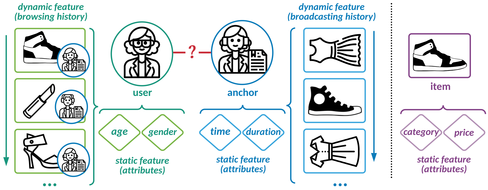

# TWo-side Interactive NetworkS (TWINS)

<p align="center">
  
  <br />
  <br />
</p>

This a `tensorflow` implementations of TWINS model. This is the experiment code in the following work:


> Who to Watch Next: Two-side Interactive Networks for Live Broadcast Recommendation </br>
> Jiarui Jin, Xianyu Chen, Yuanbo Chen, Weinan Zhang, Renting Rui, Zaifan Jiang, Zhewen Su, Yong Yu. </br>
> [WWW 2022](https://arxiv.org/pdf/2202.04333.pdf)


### References
If you find this work helpful in your research, please consider citing the following paper. The bibtex are listed below:
```bibtex
@inproceedings{jin2022watch,
  title={Who to Watch Next: Two-side Interactive Networks for Live Broadcast Recommendation},
  author={Jin, Jiarui and Chen, Xianyu and Chen, Yuanbo and Zhang, Weinan and Rui, Renting and Jiang, Zaifan and Su, Zhewen and Yu, Yong},
  booktitle={WWW},
  year={2022}
}
```
